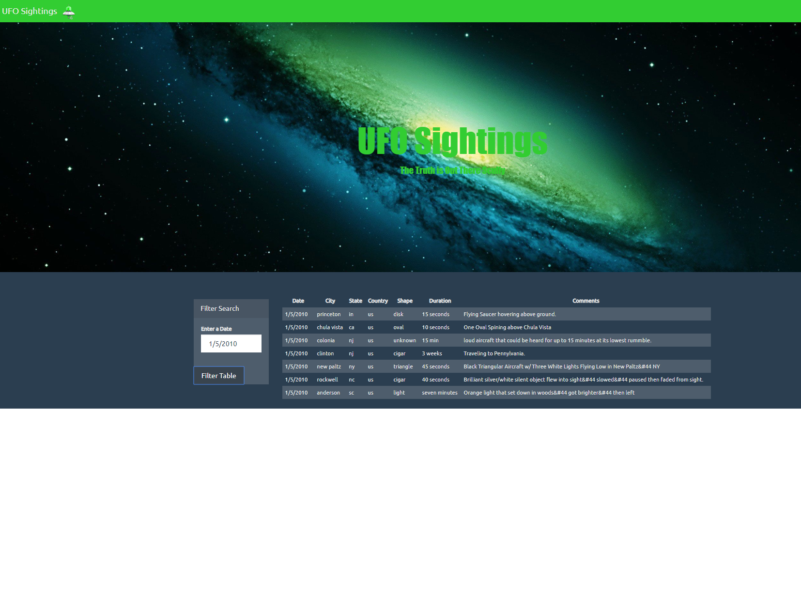

# JavaScript Website Project using UFO Sightings database, and creating an interactive dashboard. 
By: Melissa Wright. 
-------
## The Task
 
1. Create a new repository  called `javascript-challenge`.  

2. Create folders: **UFO-level-1** and **UFO-level-2**.

3. Add **html** files and static folder containing the javascript as main script to run for analysis.

### Challenge: Create Automatic Table and Date Search (User-Interactive Website)

* Create a basic HTML web page or use the [index.html](StarterCode/index.html) file provided (customize page).
* Using the UFO dataset provided in the form of an array of JavaScript objects, write code that appends a table to your web page and then adds new rows of data for each UFO sighting.
* Make sure you have a column for `date/time`, `city`, `state`, `country`, `shape`, and `comment` at the very least.

* Use a date form in your HTML document and write JavaScript code that will listen for events and search through the `date/time` column to find rows that match user input.
 
### Dataset

* [UFO Sightings Data](StarterCode/static/js/data.js)

 ### Completed Project: Website Screenshots illustrating UFO Sighting Searches

 
--
## Summary & Conclusion: 
* Creating the website was easy, the challenging part was being able to run a script to filter the data from the database and refresh the website at each search. 
